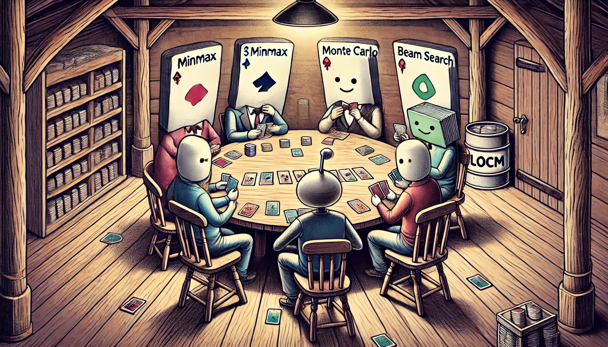

# LOCM_Agent

Provided by DALL-E

## What's Here
1. This repo contained agents based on heuristic algorithm for [LOCM](https://www.codingame.com/ide/puzzle/legends-of-code-magic)
2. Code reproduction of the [CCG competitions](https://github.com/acatai/Strategy-Card-Game-AI-Competition/tree/master) over the years on the existing benchmarks.
3. Based on existing benchmarks, methods including minmax, Monte Carlo and beam search are provided here
